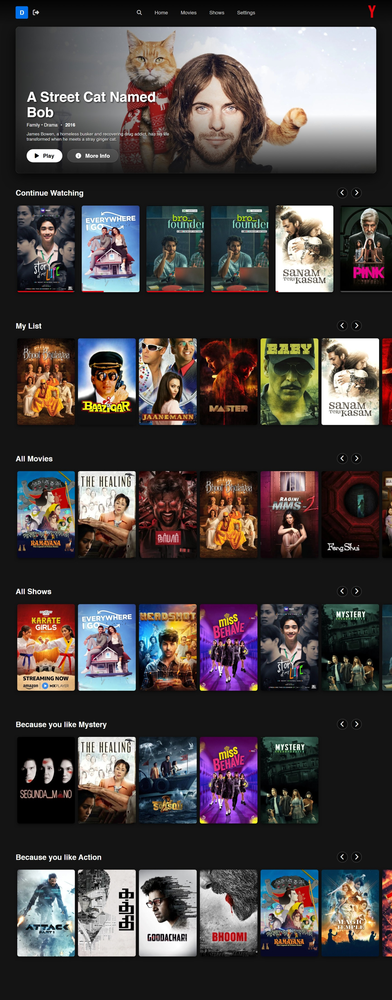
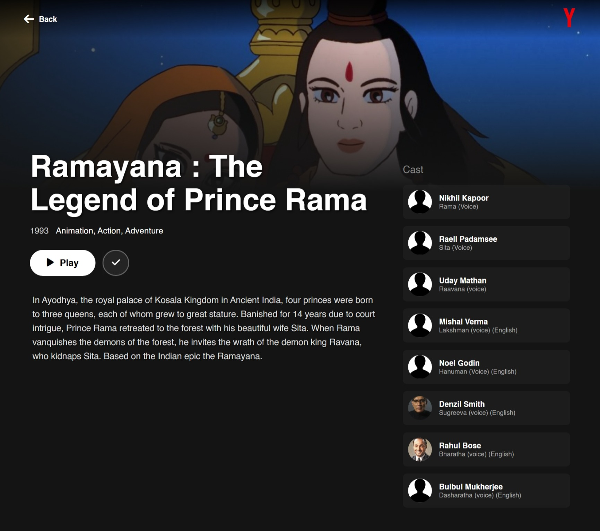
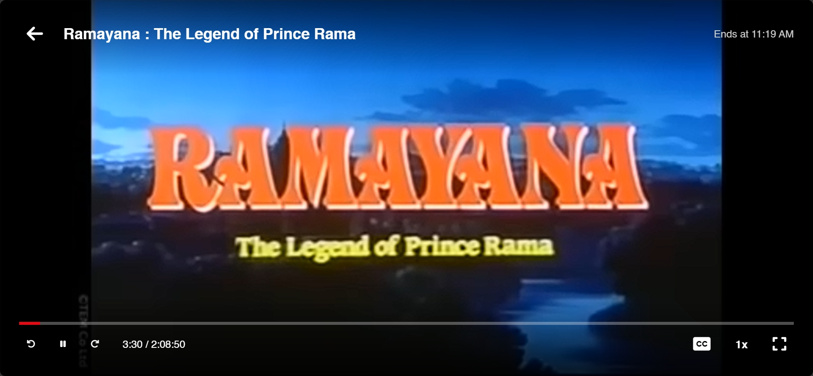
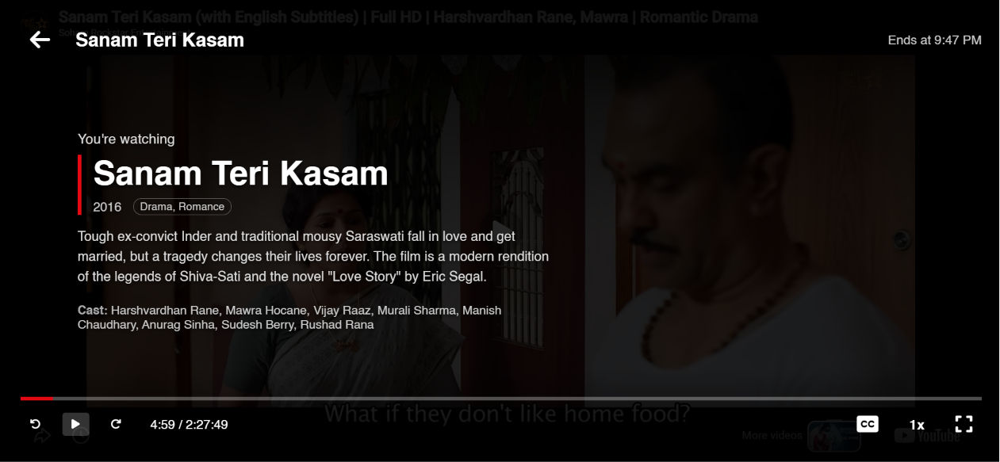

# YTFlix

YTFlix is a self-hosted, premium streaming interface designed to organize and play your favorite free YouTube movies and web series. It provides a cinematic, modern experience completely free of charge.

**YTFlix Homepage**

**YTFlix Content Page**

**YTFlix Player Interface**

**YTFlix Player Interface**

## 📖 The Story Behind YTFlix

I created YTFlix as a project because I wanted a way to watch movies legally without relying on piracy due to ethical concerns. Since YouTube has many official channels that offer free, full-length movies, I realized: *why not compile them into a playlist and display them in a dedicated streaming interface?*

This project was built to give those who are short on a budget a premium viewing experience. It provides a clean, ad-free player interface, removing the clutter and interruptions of standard video platforms, and organizes everything into a beautiful, easy-to-navigate catalog.

## ✨ Features

- **Cinematic Interface**: A modern, sleek UI with hero carousels, backdrop banners, and responsive grids.
- **TV & Controller Friendly**: Full DPAD/keyboard navigation support, making it perfect for living room setups or Smart TVs.
- **Progress Tracking**: Automatically saves your watch history and resume points for all movies and episodes.
- **Watchlist**: Add your favorite movies and shows to your personal watchlist.
- **Multi-Profile Support**: Create different profiles with custom avatars and optional PIN locks.
- **Automated Metadata Fetching**: Easily pull high-quality posters, backdrops, cast info, and descriptions using the TMDB API.
- **YouTube Playlist Sync**: Automatically sync entire web series or TV shows from a YouTube playlist into organized episodes.

## ⚠️ Disclaimer

**This project is NOT affiliated, associated, authorized, endorsed by, or in any way officially connected with Netflix or YouTube.**

YTFlix **does not** host, provide, or distribute any movies or copyrighted content out of the box. It is merely a user interface (player). You, the user, must provide your own content by linking to publicly available YouTube playlists and videos.

**Fair Use & Ethical Standards:** This project was created with the strict intention of providing a clean interface for legally available, free-to-watch content on YouTube. We kindly, but firmly, request that developers refrain from forking or repurposing this codebase to build, support, or distribute unauthorized piracy platforms. Please respect the original ethical vision of this project.

## ℹ️ Note on YouTube Player Constraints

While YTFlix strives to provide a seamless, custom cinematic player interface, you may occasionally notice native YouTube player controls (especially when starting a video or pausing), as well as End Video Suggestions and Annotations. 

**This is a technical limitation.** The underlying YouTube API architecture does not allow developers to completely hide or disable certain core UI elements, such as annotations, end video suggestions, or the native player controls. These elements may still occasionally appear during specific playback interactions to ensure the video stream functions correctly.

## 🚀 Getting Started

### Prerequisites
- PHP 8.0+
- MySQL/MariaDB
- A local server environment (XAMPP, WAMP, Docker, etc.)

### Installation
1. Clone this repository into your web server's public directory.
2. Duplicate `config.example.php` and rename it to `config.php`.
3. Update `config.php` with your local database credentials.
4. Open the site in your browser. The application will automatically create the required database and tables.
5. Log in with the default admin account (Username: `admin`, Password: `admin`).
6. Navigate to the **Account Settings** tab in the header and provide your **YouTube API v3 Key** and **TMDB API Key**.

---
*Built with ❤️ for movie lovers on a budget.*