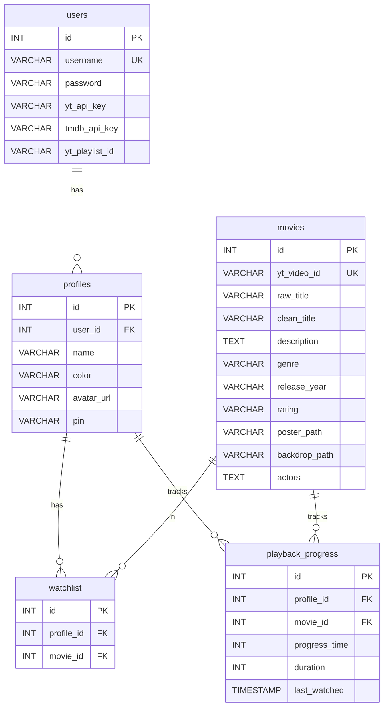

# YTFlix — Complete System Review & Analysis

> **Date:** 2026-05-11 | **File:** [index.php](file:///e:/IT/xampp/htdocs/ytflix/index.php) (2,448 lines, ~123 KB)

---

## 1. Project Overview

**YTFlix** is a self-hosted, Netflix-like streaming interface that plays **YouTube videos** from a user-defined playlist. It enriches video metadata by cross-referencing with **TMDB (The Movie Database)** API, giving raw YouTube titles proper movie posters, backdrops, cast info, genres, and descriptions.

The entire application is a **single-file PHP monolith** (`index.php`) containing all backend logic, HTML views, CSS styles, and JavaScript — a "God file" architecture running on XAMPP (Apache + MySQL).

---

## 2. Technology Stack

| Layer | Technology |
|---|---|
| **Backend** | PHP 8.x (procedural), PDO for MySQL |
| **Database** | MySQL (`ytflix` database) |
| **Frontend** | Vanilla HTML/CSS/JS (no frameworks) |
| **APIs** | YouTube Data API v3, YouTube IFrame Player API, TMDB API v3 |
| **Server** | XAMPP (Apache), `localhost:3306` |
| **Icons** | Font Awesome 6.4.0 (CDN) |
| **Auth** | Session-based + 30-day auto-login cookies |

---

## 3. Database Schema (5 tables)



> [!NOTE]
> Schema auto-creates on first run. Safe migrations (silent `ALTER TABLE` attempts) handle upgrades for: `avatar_url`, `pin`, `rating`, `duration` columns.

---

## 4. Architecture & Routing

### 4.1 Page Routing (Query String `?p=`)
| Route | Access | Description |
|---|---|---|
| `?p=login` | Public | Login form (default admin: `admin/admin`) |
| `?p=profiles` | Auth required | Netflix-style profile picker ("Who's watching?") |
| `?p=home` | Auth + Profile | Main browsing view (hero carousel, sliders, continue watching) |
| `?p=admin&tab=account` | Auth + Profile | Account settings (API keys, profile management, PIN, password) |
| `?p=admin&tab=library` | Auth + Main Profile only | Movie library management (sync, edit, delete) |

### 4.2 AJAX Endpoints (`?ajax=`)
| Endpoint | Method | Description |
|---|---|---|
| `?ajax=toggle_watchlist` | POST | Add/remove movie from profile's "My List" |
| `?ajax=save_progress` | POST | Saves playback position + duration |
| `?ajax=get_home_data` | GET | Returns refreshed home page HTML + watchlist/progress data as JSON |

### 4.3 POST Action Handlers
| POST field | Lines | Description |
|---|---|---|
| `login` | 307-319 | User authentication |
| `login_profile_id` | 321-335 | Profile PIN verification |
| `create_profile` | 361-378 | Create new profile (main profile only) |
| `rename_profile` | 380-389 | Rename a profile |
| `update_profile_pic` | 391-400 | Upload new avatar |
| `delete_profile_pic` | 402-408 | Remove avatar |
| `update_pin` | 410-419 | Set/remove 4-digit PIN lock |
| `delete_profile` | 421-434 | Delete profile (main profile protected) |
| `update_password` | 436-442 | Change admin password |
| `sync_playlist` | 444-498 | Sync YouTube playlist → fetch TMDB metadata |
| `update_settings` | 500-505 | Save API keys and playlist URL |
| `edit_movie` | 507-534 | Edit movie metadata (manual or TMDB force-sync) |
| `delete_movie` | 536-541 | Delete a movie |

---

## 5. Core Features

### 5.1 User & Profile System
- **Single admin user** model (auto-created on first run as `admin/admin`)
- **Multi-profile** support (Netflix-style household accounts)
- **Main profile** (first profile created) has admin privileges (settings, library)
- **4-digit PIN lock** on individual profiles
- **Custom avatars** (upload jpg/png/gif/webp, stored in `uploads/avatars/`)
- **30-day persistent sessions** via cookies (`ytflix_user`, `ytflix_profile`)

### 5.2 Content Library
- **Playlist sync**: Imports all videos from a YouTube playlist via YouTube Data API v3
- **TMDB metadata enrichment**: Auto-matches titles → fetches poster, backdrop, cast (top 8), genres, release year, description
- **Fallback handling**: If TMDB match fails, uses YouTube thumbnail + raw title
- **Manual metadata editing**: Admin can manually edit title, year, backdrop, description
- **TMDB Force Sync**: Paste a TMDB movie URL/ID to re-fetch correct metadata for mismatched titles
- **Smart TMDB search**: Tries with year → without year → first 2 words (progressive fallback)

### 5.3 Home Page UI
- **Hero Carousel**: 5 random movies with backdrop images, auto-rotates every 15s, pauses when focused
- **Continue Watching Row**: Poster-to-backdrop transition on hover, progress bar, time remaining
- **My List (Watchlist)**: Horizontal poster slider
- **All Movies**: Shuffled horizontal slider
- **Genre Rows**: 2 random genre-based rows ("Because you like [genre]")

### 5.4 Video Player
- **Custom player controls** over YouTube IFrame (native controls hidden)
- Play/Pause, Skip ±10s, Seek bar, Fullscreen
- **Subtitle/CC menu**: Loads YouTube captions, allows track selection or "Off"
- **Playback speed**: Cycles through 0.5x, 1x, 1.25x, 1.5x, 2x
- **Time display toggle**: Click to switch between elapsed and remaining time
- **"Ends at" time**: Shows estimated end time accounting for playback speed
- **Auto-save progress**: Every 5 seconds, resets to 0 if within 10s of end
- **Resume support**: Modal and hero buttons show "Resume" if progress exists

### 5.5 TV/D-Pad Navigation
- Full **keyboard/remote navigation** with arrow keys
- `tv-focusable` class marks all interactive elements
- Spatial navigation algorithm (closest element in pressed direction)
- Scoped navigation (respects modal/player/dropdown boundaries)
- Focus-ring styling with white outline + scale + glow
- Nav center links use pill-shaped focus styling
- Hero → Sliders vertical navigation flow

---

## 6. Design Patterns & Styling

### 6.1 Visual Design
- **Netflix-inspired** dark theme (#141414 base, #E50914 primary red)
- Glassmorphism on hero buttons (backdrop-filter blur)
- CSS transitions/animations throughout (slideUp modal, hover scales, opacity fades)
- Responsive design with media queries (768px breakpoint)
- Custom scrollbar styling (hidden on sliders, styled on modal)

### 6.2 CSS Architecture
- CSS variables for theming (`:root` custom properties)
- All styles inline in `<style>` block (lines 580-910)
- Clamp functions for fluid typography/sizing

### 6.3 Continue Watching Row (Unique Design)
- **Poster → Backdrop morph** on hover/focus
- Container width transitions from portrait (2:3) to landscape (16:9)
- Progress bar overlay at bottom of image
- Info panel appears below on hover (title + time remaining)

---

## 7. File Structure

```
ytflix/
├── index.php          — Main application (2,448 lines, ALL logic)
├── index0.php         — Backup/previous version
├── favicon.png        — Browser tab icon
├── y.png              — Small "Y" logo for navbar
├── ytflix.png          — Full YTFlix logo
├── avatar-cast.jpg    — Default cast member photo fallback
└── uploads/
    └── avatars/       — User-uploaded profile pictures
        ├── *.png
        ├── *.webp
        └── *.gif
```

---

## 8. Potential Issues & Observations

> [!WARNING]
> These are observations from code review, NOT changes. Listed for awareness before we begin tasks.

### 8.1 Security Concerns
| Issue | Location | Severity |
|---|---|---|
| **No CSRF protection** on any forms | All POST handlers | High |
| **No input sanitization** on SQL for cookie-based auto-login | Line 252 | Medium (uses prepared stmt, but cookie value is user-controlled) |
| **Password stored as `admin`** default | Line 94 | Low (expected for self-hosted) |
| Avatar upload allows `.gif` (potential XSS via SVG-in-GIF) | Line 235 | Low |
| **No rate limiting** on login attempts | Lines 307-319 | Medium |
| Playlist ID from URL not validated/sanitized | Lines 452-455 | Low |

### 8.2 Functional/Logic Issues
| Issue | Location | Notes |
|---|---|---|
| `toggleDropdown()` references `settingsDropdown` which doesn't exist in HTML | Line 1650 | Dead code |
| `addPinDigit()` and `updatePinDots()` called but never defined | Lines 2209, 2214 | Will throw JS error if PIN modal + D-pad used |
| `currentPin` variable referenced but never declared | Line 2212 | Same issue as above |
| `ob_start()` at line 2 + `ob_start()` at line 1073 — nested buffering may cause issues | Lines 2, 1073 | Could conflict with AJAX JSON responses |
| `$page == 'profiles'` unsets `$_SESSION['profile_id']` on every visit | Line 547 | Intentional but aggressive — visiting profiles page always logs out of profile |
| No validation that movie_id exists before watchlist toggle | Line 280 | Could insert invalid FK |
| Hero carousel `ORDER BY RAND()` on every page load | Line 1055 | Performance concern on large libraries |

### 8.3 UI/UX Issues
| Issue | Notes |
|---|---|
| Search icon in nav (`fa-search`) has no search functionality implemented | Links to `#` |
| "Movies" and "Shows" nav links point to `#movies` and `#shows` — Shows section doesn't exist | No shows/series implementation |
| No loading spinner or feedback during playlist sync (can take minutes) | Button text changes but no visual indicator |
| Mobile nav center links overflow without clear scroll indicator | Could confuse users |
| No "No results" message in admin search | Just shows empty grid |

### 8.4 Performance
| Issue | Notes |
|---|---|
| Single 123KB monolith file | Should ideally be split but works fine for self-hosted |
| All movies fetched on every home page load | `SELECT * FROM movies ORDER BY id DESC` |
| TMDB sync is synchronous, no batch/queue | Blocks PHP execution for large playlists |
| No caching of TMDB API responses | Each sync re-fetches for new items only |

---

## 9. Key Architectural Decisions

1. **Single-file design**: Intentional for easy deployment on XAMPP — no composer, no npm, just drop the file
2. **Output buffering**: Home content is captured via `ob_start()`/`ob_get_clean()` to serve both as HTML (normal page) and JSON (AJAX refresh)
3. **TV-first navigation**: The entire UI is designed to work with D-pad/remote controls, with spatial navigation algorithm
4. **Profile isolation**: Each profile has its own watchlist and playback progress — fully independent
5. **Main profile = admin**: The first profile created under a user account gets admin privileges

---

## 10. Summary

YTFlix is a **mature, feature-rich** Netflix clone that transforms YouTube playlists into a cinema-like streaming experience. The codebase is well-structured within its single-file constraint, with clear section separators and logical organization. The TV/remote navigation system is sophisticated, and the Continue Watching row with poster-to-backdrop morphing is a premium UI touch.

**I'm now fully familiar with the system and ready for your tasks.** Please let me know what bugs, errors, design issues, or updates you'd like to tackle.
